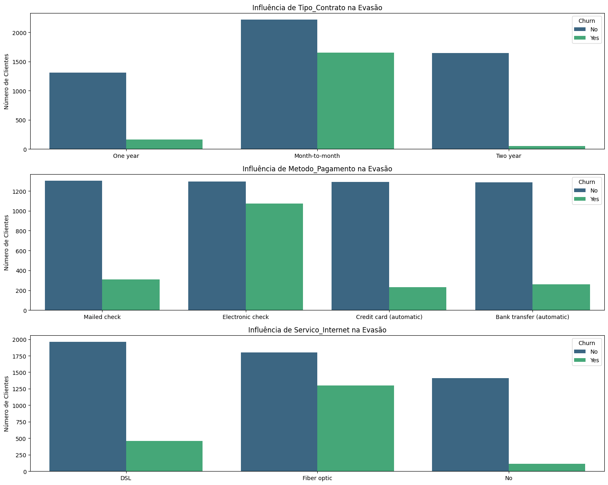
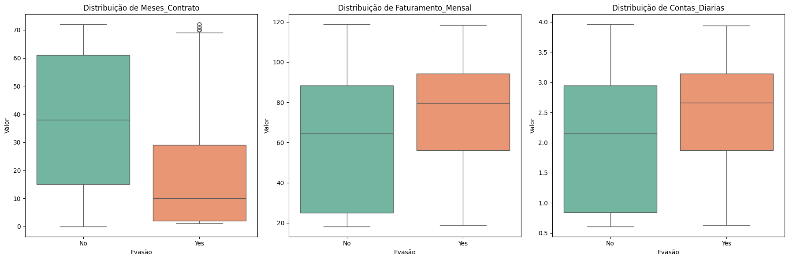

# 📡 Telecom X: Análise Estratégica de Churn

## 📝 Descrição do Projeto

Projeto de análise de Churn (evasão de clientes) desenvolvido para o Challenge Alura. O projeto consistiu na identificação de padrões estratégicos na Telecom X através do uso de Python e das bibliotecas Pandas e Seaborn para manipulação e visualização de dados.

O objetivo principal foi transformar dados brutos, extraídos de uma API em formato JSON, em informações acionáveis para reduzir a taxa de cancelamento da empresa, focando na experiência do cliente e na eficiência operacional.

## 📊 Resultados da Análise

Abaixo, apresento os três pilares visuais que fundamentaram as decisões estratégicas deste projeto:

### 1. Panorama Geral da Evasão
Identifiquei que a taxa de Churn da Telecom X é de **26,54%**. O gráfico abaixo mostra o volume de clientes que deixaram a base em comparação aos que permaneceram.

### 2. Influência das Variáveis Categóricas
Observei que contratos mensais, pagamentos via cheque eletrônico e o serviço de fibra óptica são os principais "gatilhos" de evasão, exigindo atenção imediata.

### 3. Perfil de Risco (Análise Numérica)
Comprovei que a evasão é mais comum em clientes novos (primeiros 10 meses) e naqueles que possuem faturamento mensal acima da média da empresa.

---
## 🎯 Conclusões e Decisões Estratégicas

Após correlacionar os dados demográficos, financeiros e de serviços, identifiquei que o foco da **Telecom X** deve ser a retenção preventiva nos primeiros 12 meses. Minhas recomendações estratégicas baseadas nos dados são:

* **Incentivo à Fidelização:** Implementar campanhas de migração de contratos "Mês a Mês" para modelos anuais ou bianuais, oferecendo benefícios progressivos para aumentar o custo de saída do cliente.
* **Monitoramento da Experiência em Fibra Óptica:** Realizar uma auditoria técnica e de precificação no serviço de Fibra Óptica, visto que ele apresenta a maior taxa de evasão, apesar de ser um produto de alto valor.
* **Régua de Relacionamento (Onboarding):** Criar uma trilha de comunicação intensiva para novos clientes (Tenure < 1 ano), período identificado como o de maior vulnerabilidade à perda.
* **Migração de Pagamento:** Estimular a transição do pagamento via "Electronic Check" para débito automático ou cartão de crédito, reduzindo atritos na jornada de faturamento.

## ✅ Funcionalidades

* **Extração e ETL**: Processamento de dados aninhados em formato JSON através de técnicas de `json_normalize`.
* **Tratamento de Dados**: Limpeza de valores nulos e conversão de tipos de dados para garantir a integridade da análise.
* **Feature Engineering**: Criação da métrica `Contas_Diarias` para uma visão granular do faturamento por cliente.
* **Análise Exploratória (EDA)**: Cruzamento de variáveis para identificação do perfil de cliente com maior probabilidade de Churn.
* **Insights Estratégicos**: Geração de recomendações de negócio baseadas em evidências estatísticas.

## 🛠️ Tecnologias Utilizadas

Este projeto foi construído utilizando as principais ferramentas do ecossistema de dados em Python:

* **Python**: Linguagem base para toda a manipulação lógica.
* **Pandas**: Utilizada para o tratamento, limpeza e engenharia de dados.
* **Seaborn & Matplotlib**: Bibliotecas fundamentais para a criação dos gráficos estatísticos e visuais.
* **Google Colab**: Ambiente de desenvolvimento cloud para execução e documentação.

## 🚀 Como Utilizar

Para visualizar ou executar esta análise, siga os passos abaixo:

1. Acesse o arquivo `TelecomX_Analise_Churn.ipynb` aqui no repositório.
2. O código e os resultados podem ser visualizados diretamente pelo GitHub.
3. Para executar, clique no botão **"Open in Colab"** no topo deste documento.

> **Nota:** O notebook está configurado para acessar a base de dados via URL bruta do GitHub, permitindo a execução imediata sem necessidade de uploads manuais.

## 👩‍💻 Autora

**Mikaela de Paula**

